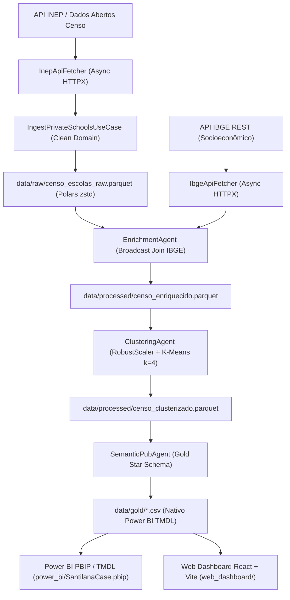

# 🏫 Pipeline de Inteligência & Dashboard Analítico de Selos Escolas (Sistemas Santillana)

[](https://www.python.org/)
[](https://powerbi.microsoft.com/)
[](https://vitejs.dev/)
[](https://clean-architecture.org/)

Este repositório contém a solução ponta a ponta para a extração, enriquecimento socioeconômico, segmentação por Machine Learning (clusterização não supervisionada), modelagem dimensional *Star Schema* e visualização analítica (Power BI PBIP e Web Dashboard em React) para os **4 Selos Educacionais da Santillana**: **Kepler**, **Uno**, **Farias Brito** e **Compartilha**.

---

## 📸 Visão Geral das Páginas do Relatório (Power BI & Web App)

### 📊 Página 1: Visão Executiva & Segmentação de Mercado (TAM/SAM)
Diagnóstico macro do mercado de escolas privadas brasileiras, com indicadores de participação (*share*) dos selos, potencial impactável e gráficos com *cross-filtering* dinâmico.

### 📈 Página 2: Comparativo Multidimensional & Diagnóstico dos Clusters
Grid analítico comparando vetores sintéticos (Índice Tecnológico, Acadêmico, Docente e Renda/Acessibilidade) entre os 4 selos recomendados.

### 🎯 Página 3: Direcionamento Comercial & Oportunidades (Prospects)
Ferramenta operacional de prospecção para consultores de expansão, com lista de escolas, scores de aderência (%) e **Ação Sugerida** personalizada por instituição.

---

## 🏛️ Arquitetura do Sistema (Clean Architecture & Agentes)

O projeto segue os princípios da **Clean Architecture** (SOLID), desacoplando a lógica de negócio dos adaptadores de infraestrutura e persistência:



---

## ⚙️ Os 4 Agentes Autônomos

1. **`IngestionAgent`**: Extração assíncrona com *rate-limiting*, retries e filtragem estrita da rede privada (`TP_DEPENDENCIA = 4`).
2. **`EnrichmentAgent`**: Unificação dos indicadores socioeconômicos (IDHM e PIB per capita) dos 5.570 municípios via API REST do IBGE.
3. **`ClusteringAgent`**: Feature engineering, escalonamento via `RobustScaler`, modelo K-Means ($k=4$), validação por *Silhouette Score* e associação vetorial dos selos:
   - **Kepler**: Escolas populares / ticket acessível (427 escolas).
   - **Uno**: Escolas inovadoras e tecnológicas (278 escolas).
   - **Farias Brito**: Rigor acadêmico e foco em vestibulares/ENEM (275 escolas).
   - **Compartilha**: Grande porte, alta qualificação docente e biblioteca (220 escolas).
4. **`SemanticPubAgent`**: Geração da camada **Gold** em modelo *Star Schema* (`d_escola`, `d_municipio`, `d_cluster_selo`, `d_calendario`, `f_censo_metricas`, `f_qualidade_pipeline`) e atualização das definições semânticas em TMDL.

---

## 🚀 Como Executar o Projeto

### 1. Requisitos Próvios
- Python 3.12+
- Node.js 18+ (para o Web Dashboard)
- Power BI Desktop (com suporte a `.pbip`)

### 2. Executar o Pipeline de Dados em Python
```bash
# Instalar dependências do pipeline
pip install httpx polars pandas scikit-learn pydantic pydantic-settings pyarrow

# Executar a esteira ponta a ponta
python run_pipeline.py
```

### 3. Abrir o Dashboard no Power BI Desktop
Basta dar duplo clique no arquivo [`SantilanaCase.pbip`](file:///d:/Projetos/ProjectBI/5.JumpSantilana/power_bi/SantilanaCase.pbip).

### 4. Executar o Web Dashboard em React + Vite
```bash
cd web_dashboard
npm install
npm run dev
```

---

## 📂 Estrutura do Repositório

```text
├── Agents.md                                # Especificação dos Agentes Autônomos
├── metricas_&_front.md                      # Especificações de DAX e Front-End
├── run_pipeline.py                          # Orquestrador CLI Principal
├── src/                                     # Código-fonte Python (Clean Architecture)
│   ├── config.py
│   ├── domain/                              # Entidades e Protocols (Interfaces)
│   ├── infrastructure/                      # Fetchers HTTPX e Repositório Polars
│   ├── use_cases/                           # Casos de uso puros
│   ├── ingestion_agent.py
│   ├── enrichment_agent.py
│   ├── clustering_agent.py
│   └── semantic_pub_agent.py
├── data/
│   ├── raw/                                 # Parquet bruto do Censo
│   ├── processed/                           # Parquet enriquecido e clusterizado ML
│   └── gold/                                # Modelo dimensional Star Schema (CSV/Parquet)
├── power_bi/                                # Estrutura e Modelo Semântico do Power BI
│   ├── SantilanaCase.pbip                   # Arquivo principal PBIP (Power BI Developer Mode)
│   ├── SantilanaCase.SemanticModel/         # Definições do Modelo Semântico em TMDL
│   └── SantilanaCase.Report/                # Definições visuais e layout dos relatórios
└── web_dashboard/                           # Aplicação Web React + Vite com Cross-filtering
```
